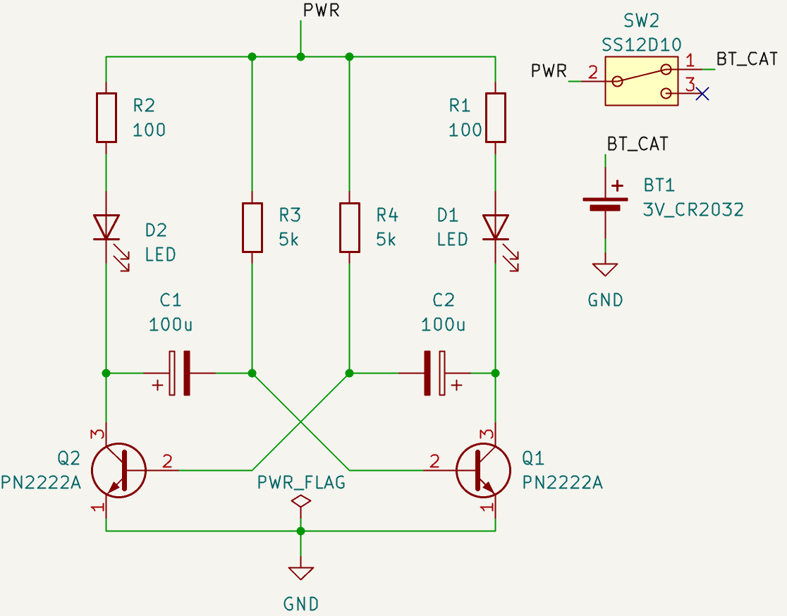

# Flip Flop LED
This project provides schematic and PCB layout of a simple **Flip Flop LED circuit** using basic electronic components. The circuit alternately turns LEDs on and off (blinking pattern), often used for learning the basics of electronics, digital logic, and timing circuits.
<table>
  <tr>
    <td align="center">
      
       Front View of The Board
    </td>
    <td align="center">
      
       Back View of The Board
    </td>
  </tr>
</table>

---

## Features
- Alternating LED blinking (Flip Flop behavior)  
- Easy to change time constant based on resistance and capacitance values  
- Educational project for beginners in electronics  

---

## Components Used
- 2 × LEDs (any color)  
- 2 × Resistors 100-330Ω
- 2 x Resistors 1k-5kΩ
- 1 × NPN Transistor (e.g., 2N2222 or BC547)  
- 1 × Capacitor 100uF
- 1 × Battery Coin 3V (CR2032)
- 1 x Slide switch SS12D10

---

## Circuit Diagram
The flip flop effect can be achieved using a pair of transistors with cross-coupled capacitors.  

  

 
